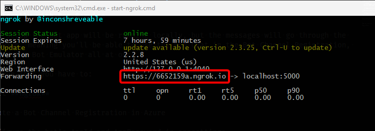
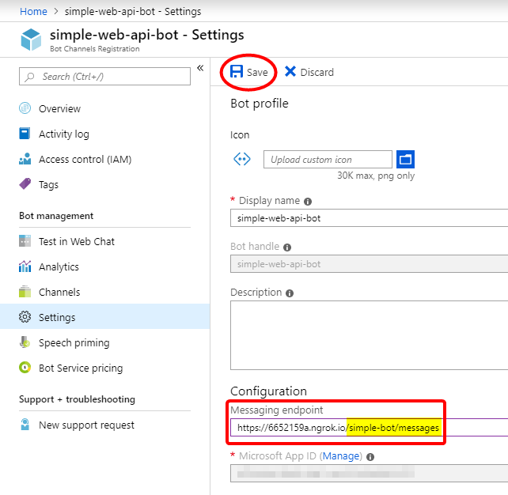
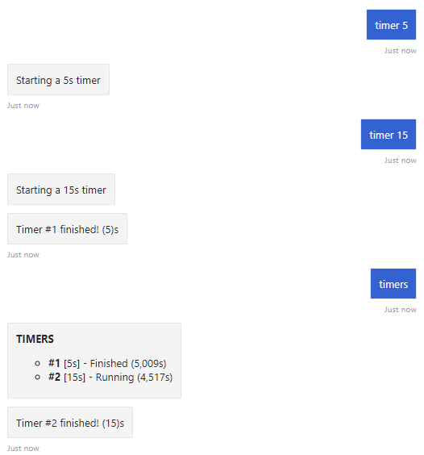
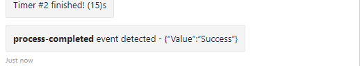
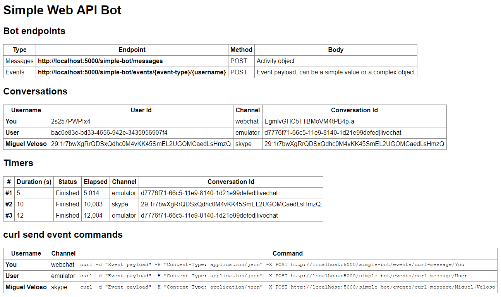

# GAB2019-EventBot

This repo contains the implementation of a simple bot with Bot Builder v4 C# SDK using an ASP.NET Core Web API app.

This repo goes along with two of my blog posts:

- [How to receive events in a Bot Framework SDK v4 Web API bot?](https://www.coderepo.blog/posts/how-to-receive-events-bot-framework-sdk-v4-web-api-bot/)
- [How to test a Bot Framework SDK v4 bot?](https://www.coderepo.blog/posts/how-to-test-bot-framework-sdk-v4-bot/)

The bot can respond to arbitrary events sent to the endpoint POST /simple-bot/events/{event-name}/{user-name} where the Body contains an object { "Value": "anything, simple value or complex object" }

## Run locally with Bot Emulator

These are the minimal steps to test the app locally:

1. Run the app locally with VS 2019
2. Run Bot Emulator and open the **SimpleWebApiBot.bot** file.

## Run locally with Bot Service

In this setup the bot app will be running locally, but the messages will go through the Bot Service, meaning you'll be able to use the Web Chat in the Bot Channel Registration, Skype and the Bot Emulator all at once.

To achieve this you have to:

1. Start **ngrok**

2. Create a Bot Channel Registration in Azure

3. Configure the bot's AppId and AppPassword in appsettings

4. Start the web app locally

So, let's get with the details now

### Start ngrok

Open a command prompt window on the project's `ngrok` folder and run `start-ngrok`

You should see something like this:



Copy the public address you get, similar to the highlighted one above.

### Create a Bot Channel Registration

Create the Bot Channel Registration (This is the access channel to the Bot Service) and take note of the created AppId and AppPassword, they should be something similar to these (fake values):

```
AppId       : ac48a878-97c5-4815-8d14-4a0ba67965a5
AppPassword : Ngs&RYMo@0KQ1w38535%19O$
```

Configure the forwarding address from **ngrok** as the messaging endpoint, **appending** `/simple-bot/messages`.

You should have something similar to this:



**Remember to save the above settings!**

### Configure AppId and AppPassword

Save the `AppId` and `AppPassword` assigned during the Bot Channel Registration `appsettings.json` or, better yet, as user secrets like this:

```json
{
  "BotWebApiApp:AppId": "<your-bot-app-id>",
  "BotWebApiApp:AppPassword": "<your-bot-app-password>"
}
```

To access [User Secrets](https://docs.microsoft.com/en-us/aspnet/core/security/app-secrets?view=aspnetcore-2.2&tabs=windows), select **[right+click] > Manage User Secrets** on the project folder in the Solution Explorer.

## Test

1. When you send "**TIMER 5**" message, you should receive a timer setup acknowledge reply.

2. When you send a "**TIMERS**" message, you should get the list of current timers (since last startup) with their statuses.

3. You should receive a "**Timer #X finished!**" when a timer's up.

   

4. When you POST to the events endpoint you should get the posted value in the chat.

   ```console
   curl -d "{'Value':'Success'}" -H "Content-Type: application/json" -X POST http://localhost:5000/simple-bot/events/process-completed/User
   ```

   

5. When you refresh the home page (http://localhost:5000) you should see something like this (after connecting from Skype and the Bot Channel Registration Web Chat in the Azure portal):

   

**NOTE:** You can only send events to conversations shown in the home page.

Keep in mind that username is "**You**" when using Azure's test web chat and "**User**" when using the emulator. You can check this in the home page.

Hope this helps you.

Happy coding!
